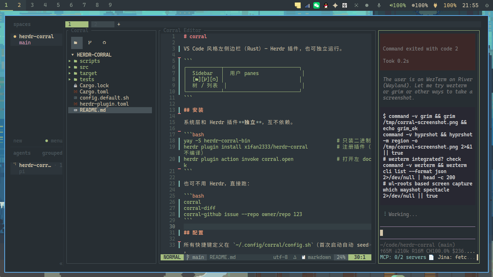

# corral

VS Code 风格左侧边栏（Rust）— Herdr 插件，也可独立运行。



## 安装

系统层和 Herdr 插件**独立**，互不依赖。

```bash
yay -S herdr-corral-bin                              # 只装二进制
herdr plugin install xifan2333/herdr-corral          # 注册插件（不编译）
herdr plugin action invoke corral.open               # 打开左 dock
```

也可不用 Herdr，直接跑：

```bash
corral
corral-github issue --repo owner/repo 123
```

## 配置

所有快捷键定义在 `~/.config/corral/config.sh`（首次启动自动 seed，
模板见 [`config.default.sh`](config.default.sh)）。已有配置不会被自动迁移或覆盖；
如需恢复最新默认配置，删除该文件后重新启动 Corral。

语法：`corral bind <key> <action>`

改键后下次启动 Corral 生效，无需重编译。

依赖 [GitHub CLI](https://cli.github.com/) `gh`；图片用默认 `imv` 打开，
可通过 `CORRAL_GITHUB_IMAGE_VIEWER` 覆盖。

### Neovim Diff 浏览

在 Herdr 或 WezTerm 中，SCM diff 会打开到复用的 Neovim terminal buffer，
并停留在 Normal mode，方便直接搜索、复制和滚动。默认使用 `delta` 渲染；
可在 Neovim 配置中加入以下映射，让 `.` / `,` 跳到下一处 / 上一处变更，
并在打开后自动跳到第一处变更：

```lua
-- Diff review in terminal buffers: ,/. to jump across changes, auto-jump on open
vim.api.nvim_create_autocmd("TermOpen", {
  callback = function(ev)
    local pat = [[\v(^\s*\d+\s*⋮\s*│|^\s*⋮\s*\d+\s*│|^\s*\d+\s*[-+])]]

    vim.keymap.set("n", ".", function()
      vim.fn.search(pat, "W")
    end, { buffer = ev.buf, desc = "Next diff change", silent = true })

    vim.keymap.set("n", ",", function()
      vim.fn.search(pat, "bW")
    end, { buffer = ev.buf, desc = "Previous diff change", silent = true })

    vim.defer_fn(function()
      if vim.api.nvim_buf_is_valid(ev.buf) then
        pcall(vim.fn.search, pat, "W")
      end
    end, 120)
  end,
})
```

例如可放在 `~/.config/nvim/lua/config/keymaps.lua` 或直接放入
`init.lua`。GitHub detail 属于交互式 TUI，会自动进入 terminal-input mode，
不受以上 Normal-mode diff 浏览方式影响。

## 快捷键

### 全局

| 键 | 动作 |
|---|---|
| `1` `2` `3` | Explorer / SCM / GitHub |
| `q` `Ctrl+c` | 退出 |
| `j` `k` `↓` `↑` | 上下 |
| `g` `G` | 顶 / 底 |
| `PgUp` `PgDn` | 翻页 |
| `h` `l` `←` `→` | 折叠 / 展开 |
| `z` | 全部折叠 |
| `Enter` | 切换（文件暂存 / 打开） |
| `r` | 刷新 |

### Explorer

| 键 | 动作 |
|---|---|
| `.` | 显示/隐藏点文件 |
| `a` `d` `r` | 新建 / 删除到回收站 / 重命名 |

### SCM

| 键 | 动作 |
|---|---|
| `s` `Space` | 暂存 / 取消暂存 |
| `a` `u` | 全部暂存 / 取消暂存 |
| `o` | 查看 diff |
| `c` | 聚焦 commit message |
| `A` | 生成 commit subject |
| `D` | 丢弃改动 |
| `S` | 同步 |
| `Esc` | 取消 |

### GitHub 侧栏

| 键 | 动作 |
|---|---|
| `i` `p` `a` `w` | Issues / PRs / Actions / Workflows |
| `Enter` `o` | 打开 detail |
| `d` `c` `x` `L` | Diff / Checks / 失败日志 / 日志 |
| `f` | 过滤 |
| `]` | 加载更多 |
| `s` | 切换状态 |
| `t` | workflow dispatch |

### GitHub Detail

| 键 | 动作 |
|---|---|
| `c` | 回复 |
| `a` | Approve |
| `x` | context action |
| `D` | Close / Reopen |
| `m` | Merge（选策略） |
| `o` | 打开图片 |
| `R` `A` | Rerun failed / all |
| `Enter` `Esc` `y` | 确认 / 取消 |

## 模块

| 模块 | 作用 |
|---|---|
| `app` | sidebar 事件循环 |
| `config` | shell 配置引擎 |
| `feature/{explorer,scm,github}` | sidebar FeatureView |
| `github/{gh,model,detail}` | `gh` CLI + 数据 + 全宽客户端 |
| `git` | status 发现、stage / unstage |
| `ui` | palette / icons / activity |
| `herdr` | 宿主 CLI |

## 开发

```bash
cargo build --release
export PATH="$PWD/target/release:$PATH"
herdr plugin link .
herdr plugin action invoke corral.open
```
